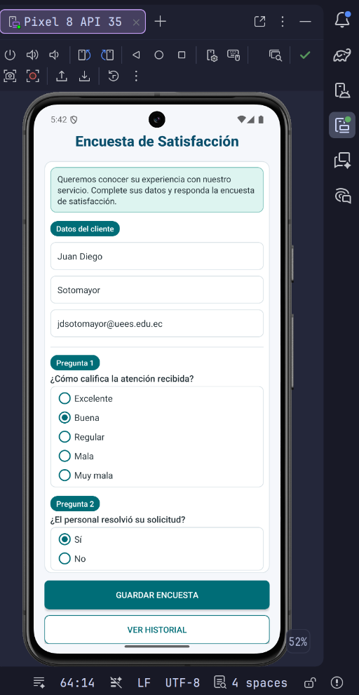
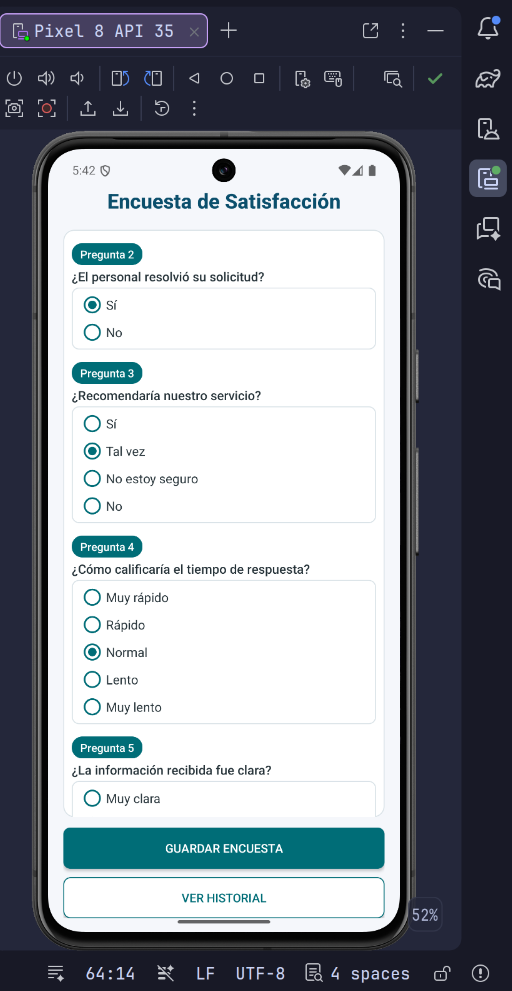
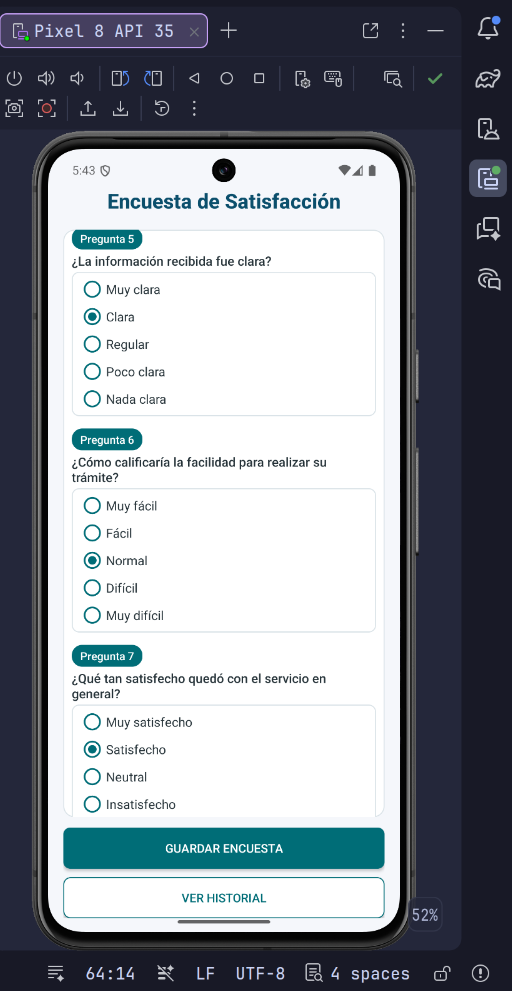
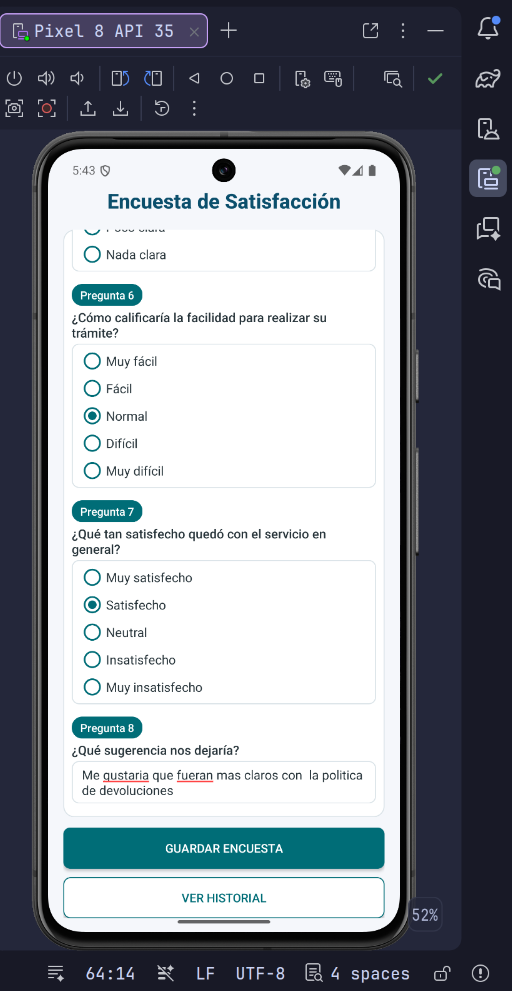
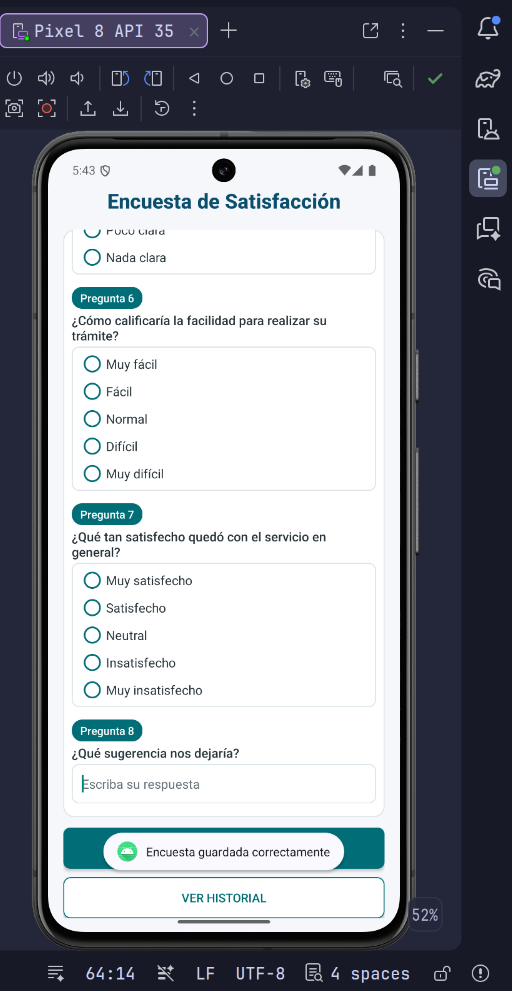
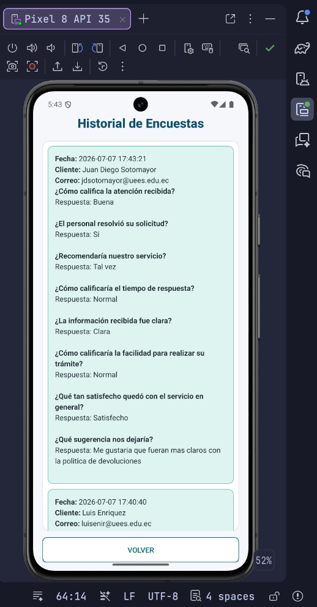
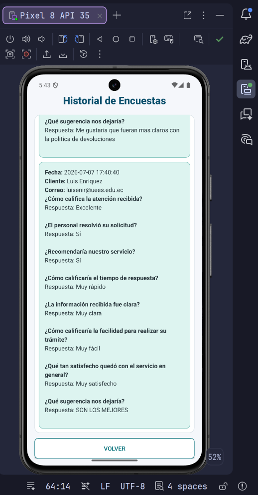
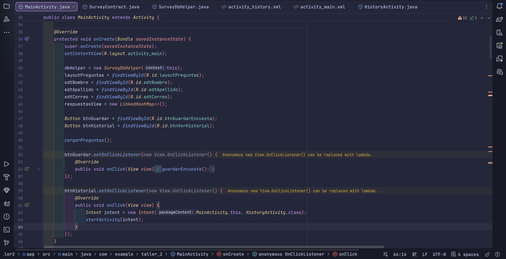
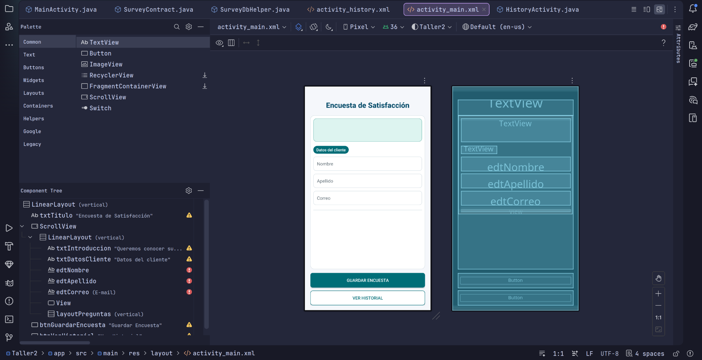
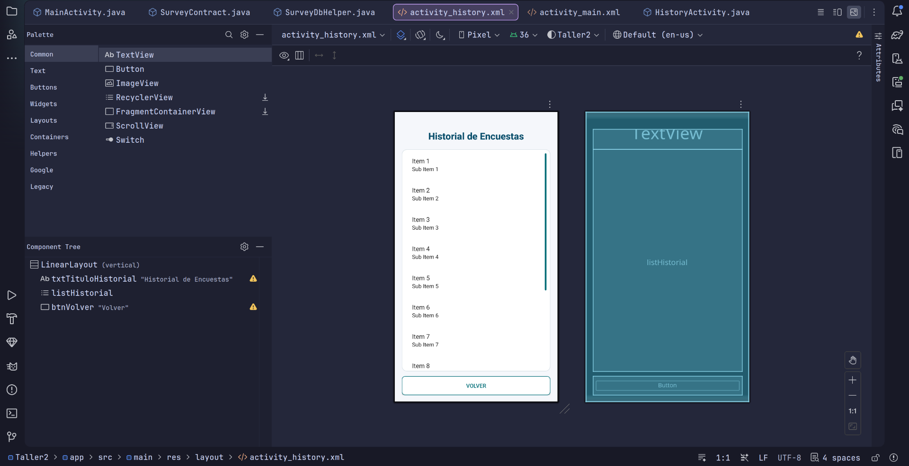

# Taller 2 - App de Encuestas Offline con SQLite

## Objetivo

Desarrollar una aplicacion Android en Java que permita responder una encuesta de satisfaccion sin conexion a internet, cargando las preguntas desde una base de datos SQLite local.

La app trabaja con datos del cliente, preguntas precargadas y respuestas guardadas localmente:

| Campo | Descripcion |
|---|---|
| `nombre` | Nombre de la persona que responde la encuesta. |
| `apellido` | Apellido de la persona que responde la encuesta. |
| `correo` | Correo del cliente encuestado. |
| `id_pregunta` | Identificador numerico de cada pregunta cargada desde SQLite. |
| `texto_pregunta` | Texto de la pregunta guardada en la tabla `preguntas`. |
| `respuesta_usuario` | Respuesta seleccionada o escrita por el usuario. |
| `fecha_registro` | Fecha y hora usada para agrupar las respuestas de una misma encuesta. |

---

## Funcionamiento completo

La aplicacion esta compuesta por dos pantallas:

| Pantalla | Funcion |
|---|---|
| Encuesta de satisfaccion | Muestra datos del cliente, carga preguntas desde SQLite y permite guardar respuestas. |
| Historial de encuestas | Lista las encuestas guardadas, agrupadas por fecha y con preguntas/respuestas. |

Flujo principal:

1. Al abrir la app, `SurveyDbHelper` crea la base local `Encuestas.db`.
2. Dentro de `onCreate()` del helper se crean las tablas `preguntas` y `respuestas`.
3. En ese mismo `onCreate()` se insertan automaticamente las preguntas iniciales de la encuesta.
4. `MainActivity` consulta la tabla `preguntas`.
5. La interfaz de preguntas se genera dinamicamente en Java.
6. El usuario ingresa `nombre`, `apellido` y `correo`.
7. Las preguntas 1 a 7 se responden con opcion multiple.
8. La pregunta 8 se responde escribiendo una sugerencia.
9. Al presionar `Guardar Encuesta`, la app valida que todos los campos esten completos.
10. Todas las respuestas se guardan en SQLite con la misma fecha y hora.
11. Al presionar `Ver Historial`, se abre una segunda pantalla con las encuestas guardadas.
12. El historial muestra cliente, correo, fecha, preguntas y respuestas.

---

## Capturas de evidencia

Las capturas se encuentran en la carpeta `capturas/` y estan referenciadas con rutas relativas para que se visualicen correctamente en GitHub.

### Captura 1 - Desarrollo de la pantalla principal



Se muestra Android Studio con el codigo Java de la actividad principal y el emulador ejecutando la app. La pantalla principal contiene el titulo, el bloque de datos del cliente y las preguntas generadas dinamicamente.

### Captura 2 - Datos del cliente y primeras preguntas



Se evidencia el formulario inicial de la encuesta. Incluye una introduccion, los campos `Nombre`, `Apellido`, `Correo` y las primeras preguntas cargadas desde SQLite.

### Captura 3 - Preguntas de opcion multiple y sugerencia



Se muestran preguntas de opcion multiple del formulario y la pregunta final abierta para escribir una sugerencia.

### Captura 4 - Guardado de encuesta



Se evidencia el guardado correcto de una encuesta. La app muestra el mensaje de confirmacion `Encuesta guardada correctamente` despues de insertar las respuestas en SQLite.

### Captura 5 - Historial con encuestas guardadas



Se muestra la pantalla `Historial de Encuestas`, donde las respuestas aparecen agrupadas por fecha y por cliente. Cada item contiene las preguntas y sus respuestas.

### Captura 6 - Historial escalable



Se evidencia que el historial puede mostrar varias encuestas usando un `ListView`. Cada encuesta se presenta como un elemento separado con formato visual y espaciado.

### Captura 7 - Implementacion de guardado



Se muestra codigo Java relacionado con la validacion y guardado de la encuesta. Las respuestas se insertan usando `ContentValues` y se asocian a la fecha de la encuesta.

### Captura 8 - Layout principal



Se muestra el archivo `activity_main.xml` en Android Studio junto con la vista previa. El XML contiene el contenedor principal, campos de cliente y botones, pero no contiene las preguntas fijas de la encuesta.

### Captura 9 - Layout de historial



Se muestra el archivo `activity_history.xml` con el `ListView` usado para presentar el historial. La pantalla mantiene la misma paleta visual del formulario principal.

### Captura 10 - Vista previa del historial



Se muestra el diseno visual de `activity_history.xml` en Android Studio. La vista previa evidencia el titulo, el `ListView` desplazable y el boton `Volver`.

---

## Tecnologias utilizadas

| Tecnologia | Uso |
|---|---|
| Android Studio | Entorno de desarrollo y ejecucion en emulador. |
| Java | Lenguaje principal de la aplicacion. |
| XML | Construccion de layouts y recursos visuales. |
| SQLite | Persistencia local de preguntas y respuestas. |
| SQLiteOpenHelper | Creacion, actualizacion y administracion de la base de datos. |
| Cursor | Lectura de preguntas y respuestas desde SQLite. |
| ContentValues | Insercion de respuestas en SQLite. |
| Gradle | Compilacion del proyecto Android. |

---

## Archivos principales

| Archivo | Funcion |
|---|---|
| `app/src/main/java/com/example/taller_2/MainActivity.java` | Pantalla principal, carga dinamica de preguntas y guardado de respuestas. |
| `app/src/main/java/com/example/taller_2/HistoryActivity.java` | Pantalla de historial y consulta de encuestas guardadas. |
| `app/src/main/java/com/example/taller_2/SurveyContract.java` | Contrato de tablas, columnas y sentencias SQL de SQLite. |
| `app/src/main/java/com/example/taller_2/SurveyDbHelper.java` | Helper encargado de crear, actualizar y precargar la base de datos. |
| `app/src/main/res/layout/activity_main.xml` | Layout principal con contenedor dinamico, datos del cliente y botones. |
| `app/src/main/res/layout/activity_history.xml` | Layout de historial con `ListView` y boton de retorno. |
| `app/src/main/res/layout/item_historial.xml` | Layout de cada item del historial. |
| `app/src/main/res/drawable/bg_panel.xml` | Fondo de los paneles principales. |
| `app/src/main/res/drawable/bg_input_box.xml` | Fondo de campos de texto y opciones. |
| `app/src/main/res/drawable/bg_question_badge.xml` | Fondo de etiquetas `Pregunta 1`, `Pregunta 2`, etc. |
| `app/src/main/res/drawable/bg_history_item.xml` | Fondo de cada encuesta en el historial. |
| `app/src/main/res/drawable/bg_button_primary.xml` | Estilo del boton `Guardar Encuesta`. |
| `app/src/main/res/drawable/bg_button_secondary.xml` | Estilo de botones secundarios. |
| `app/src/main/AndroidManifest.xml` | Declaracion de `MainActivity` y `HistoryActivity`. |

---

## Base de datos

La aplicacion usa una base de datos SQLite local llamada `Encuestas.db`.

### Tabla `preguntas`

| Campo | Tipo | Descripcion |
|---|---|---|
| `_id` | INTEGER PRIMARY KEY AUTOINCREMENT | Identificador interno generado por SQLite. |
| `id_pregunta` | INTEGER UNIQUE | Identificador logico de la pregunta. |
| `texto_pregunta` | TEXT NOT NULL | Texto de la pregunta mostrada en la encuesta. |

Sentencia de creacion:

```sql
CREATE TABLE preguntas (
    _id INTEGER PRIMARY KEY AUTOINCREMENT,
    id_pregunta INTEGER UNIQUE,
    texto_pregunta TEXT NOT NULL
);
```

Preguntas precargadas:

| Id | Pregunta | Tipo |
|---|---|---|
| 1 | ¿Como califica la atencion recibida? | Opcion multiple |
| 2 | ¿El personal resolvio su solicitud? | Opcion multiple |
| 3 | ¿Recomendaria nuestro servicio? | Opcion multiple |
| 4 | ¿Como calificaria el tiempo de respuesta? | Opcion multiple |
| 5 | ¿La informacion recibida fue clara? | Opcion multiple |
| 6 | ¿Como calificaria la facilidad para realizar su tramite? | Opcion multiple |
| 7 | ¿Que tan satisfecho quedo con el servicio en general? | Opcion multiple |
| 8 | ¿Que sugerencia nos dejaria? | Respuesta escrita |

### Tabla `respuestas`

| Campo | Tipo | Descripcion |
|---|---|---|
| `_id` | INTEGER PRIMARY KEY AUTOINCREMENT | Identificador interno de la respuesta. |
| `id_pregunta_fk` | INTEGER | Id de la pregunta respondida. |
| `respuesta_usuario` | TEXT | Respuesta seleccionada o escrita. |
| `fecha_registro` | DATETIME DEFAULT CURRENT_TIMESTAMP | Fecha y hora de la encuesta. |
| `nombre_usuario` | TEXT | Nombre del cliente. |
| `apellido_usuario` | TEXT | Apellido del cliente. |
| `correo_usuario` | TEXT | Correo del cliente. |

Sentencia de creacion:

```sql
CREATE TABLE respuestas (
    _id INTEGER PRIMARY KEY AUTOINCREMENT,
    id_pregunta_fk INTEGER,
    respuesta_usuario TEXT,
    fecha_registro DATETIME DEFAULT CURRENT_TIMESTAMP,
    nombre_usuario TEXT,
    apellido_usuario TEXT,
    correo_usuario TEXT
);
```

---

## Interfaz dinamica

Las preguntas no estan quemadas en el XML. El XML solo contiene el contenedor `layoutPreguntas` donde Java agrega los elementos visuales.

En `MainActivity.java`, la app:

1. Consulta la tabla `preguntas`.
2. Recorre el `Cursor`.
3. Crea en Java una etiqueta `Pregunta N`.
4. Crea un `TextView` con el texto de la pregunta.
5. Crea un `RadioGroup` para las preguntas de opcion multiple.
6. Crea un `EditText` para la pregunta abierta.
7. Guarda la relacion entre `id_pregunta` y la vista de respuesta usando `LinkedHashMap<Integer, View>`.

---

## Operaciones disponibles

| Operacion | Descripcion |
|---|---|
| Cargar preguntas | Lee las preguntas desde SQLite y construye la encuesta dinamicamente. |
| Responder encuesta | Permite llenar datos del cliente y responder preguntas. |
| Guardar encuesta | Valida campos, guarda respuestas y limpia el formulario. |
| Ver historial | Abre la segunda pantalla con las encuestas guardadas. |
| Volver | Cierra el historial y regresa a la pantalla principal. |

---

## Ejecucion del proyecto

Abrir el proyecto en Android Studio y sincronizar Gradle.

Compilar desde terminal:

```bash
./gradlew :app:assembleDebug
```

Instalar en un emulador conectado:

```bash
./gradlew :app:installDebug
```

El proyecto fue probado en un emulador Pixel 8 con Android 15 y mantiene `minSdk = 27`, por lo que es compatible con Android 8.1 / API 27 como base del taller.

---


## Autor

Juan Diego Sotomayor
